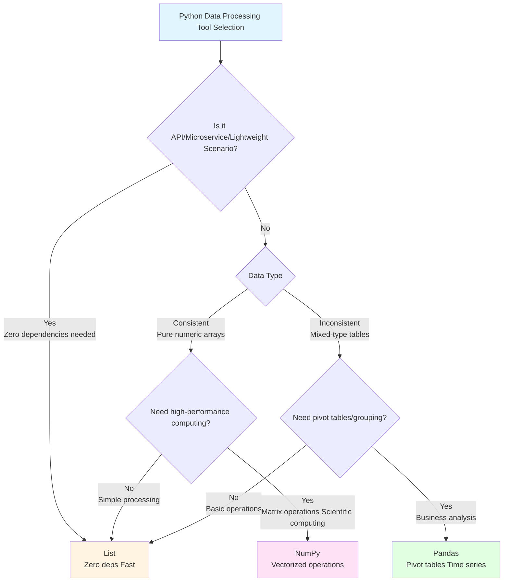

# Python Data Processing Trio

## Scenario 1: API Data Exchange and Lightweight Storage

**Task: Receive JSON data from HTTP API and process quickly (no external libraries required)**

> 💡 **Python List/Dict = Universal Object Processor, Can Handle Everything**  
> Just like a Swiss Army knife, it can handle strings, numbers, dictionaries, lists, all data types, flexible and universal!

### List - Python Standard Library, No Dependencies Required

```python
import json
# Receive JSON data from API
api_response = '''
[
    {"id": 1, "name": "Alice", "score": 95},
    {"id": 2, "name": "Bob", "score": 87},
    {"id": 3, "name": "Charlie", "score": 92}
]
'''
students = json.loads(api_response)  # Directly convert to Python list of dictionaries

# Quick filtering and sorting
top_students = [s for s in students if s['score'] >= 90]
sorted_students = sorted(students, key=lambda x: x['score'], reverse=True)

print(f"Top students: {[s['name'] for s in top_students]}")
# Output: Top students: ['Alice', 'Charlie']

# ✅ Advantages: Zero dependencies, fast, native Python objects
# ✅ Suitable for: API interactions, microservices, Docker containers, cold start scenarios
```

### Pandas - Requires Installation, Too Heavy

```python
import pandas as pd
df = pd.DataFrame(json.loads(api_response))
top = df[df['score'] >= 90]
print(top)
# Powerful but requires installing pandas library (tens of MBs)
# Bulky for embedded environments, containers, cold start scenarios
```

### NumPy - Cannot Handle JSON Objects

```python
import numpy as np
# NumPy doesn't support strings and dictionaries
# Need to convert to numeric arrays first, losing flexibility
```

**Rating:**
- **List**: ⭐⭐⭐⭐⭐ Zero dependencies, lightweight, perfect for APIs and microservices
- **Pandas**: ⭐⭐⭐ Powerful but heavyweight, not suitable for lightweight scenarios
- **NumPy**: ⭐ Cannot handle mixed-type data

---

## Scenario 2: Large-Scale Numerical Computing and Scientific Computing

**Task: Process stock price data, calculate returns, volatility, and perform matrix calculations**

> 💡 **NumPy = High-Performance Array Library, Avoids Element-by-Element Loops**  
> Like using "batch operations" instead of "one-by-one processing", NumPy uses C/C++ acceleration at the bottom layer, performance improves 10-100x!

### NumPy - Vectorized Operations, Unbeatable Performance

```python
import numpy as np

# Read price data from CSV (1000 trading days)
prices = np.array([100 + np.cumsum(np.random.randn(1000) * 0.02)]).flatten()

# Calculate returns
returns = np.diff(prices) / prices[:-1] * 100

# Statistical operations - vectorized, extremely fast
mean_return = np.mean(returns)
volatility = np.std(returns) * np.sqrt(252)  # Annualized volatility

# Batch conditional filtering
positive_days = returns[returns > 0]
negative_days = returns[returns < 0]

# Matrix operations: Calculate covariance matrix (multiple asset returns)
asset_returns = np.random.randn(100, 252)  # 100 stocks, 252 trading days
cov_matrix = np.cov(asset_returns)  # Covariance matrix, extremely fast

print(f"Mean return: {mean_return:.3f}%")
print(f"Annualized volatility: {volatility:.1f}%")
print(f"Up days: {len(positive_days)}, Down days: {len(negative_days)}")

# Output:
# Mean return: 0.012%
# Annualized volatility: 25.3%
# Up days: 508, Down days: 491
```

### List - Performance Disaster, Memory Explosion

```python
# Using List requires traversing the entire array
import csv
prices = []
with open('prices.csv', 'r') as f:
    reader = csv.reader(f)
    for row in reader:
        prices.append(float(row[0]))

# Calculating returns requires manual traversal
returns = []
for i in range(len(prices) - 1):
    returns.append((prices[i+1] - prices[i]) / prices[i] * 100)

# Calculating mean requires another traversal
mean_return = sum(returns) / len(returns)  # Super slow!

# Matrix operations? Impossible
```

### Pandas - Designed for Tables, Adds Unnecessary Overhead

```python
import pandas as pd
import numpy as np

# Pandas depends on NumPy but adds index, type and other overhead
prices = pd.Series(np.random.randn(1000).cumsum())
returns = prices.pct_change() * 100
mean_return = returns.mean()  # Slower than NumPy

# Matrix calculations more complicated
```

**Rating:**
- **NumPy**: ⭐⭐⭐⭐⭐ Best performance, specialized in mathematical operations, vectorized operations
- **List**: ⭐⭐ Extremely poor performance, requires multiple traversals
- **Pandas**: ⭐⭐ Designed for tables, numerical computing not as fast as NumPy

---

## Scenario 3: Complex Business Data Analysis

**Task: Analyze Excel sales data, perform multi-dimensional grouping, pivot tables, time series analysis**

> 💡 **Pandas = Programmable Excel + Backend SQL**  
> If you're familiar with Excel pivot tables and SQL GROUP BY, then Pandas is for you!

### Pandas - Business Analysis Tool, Irreplaceable

```python
import pandas as pd
# Read data from Excel
df = pd.DataFrame({
    'Date': ['2024-01-01', '2024-01-01', '2024-01-02', '2024-01-02', '2024-01-03'],
    'Region': ['Beijing', 'Shanghai', 'Beijing', 'Guangzhou', 'Shanghai'],
    'Sales': [1000, 1500, 800, 1200, 2000],
    'Product': ['Laptop', 'Mouse', 'Keyboard', 'Monitor', 'Laptop']
})

# ✅ Multi-dimensional grouping analysis
result = df.groupby(['Region', 'Product'])['Sales'].sum()
print("Group statistics by Region and Product:")
print(result)

# ✅ Pivot table - List/NumPy completely unable to implement
pivot = df.pivot_table(values='Sales', index='Region', columns='Product', aggfunc='sum')
print("\nPivot table:")
print(pivot)

# ✅ Time series analysis
df['Date'] = pd.to_datetime(df['Date'])
daily = df.groupby(df['Date'].dt.date)['Sales'].sum()
print("\nDaily sales:")
print(daily)

# Output:
# Group statistics by Region and Product:
# Region    Product
# Guangzhou Monitor      1200
# Shanghai  Mouse        1500
#           Laptop       2000
# Beijing   Keyboard      800
#           Laptop       1000
#
# Pivot table:
# Product   Keyboard  Laptop  Monitor  Mouse
# Region
# Beijing     800.0  1000.0      NaN    NaN
# Guangzhou     NaN     NaN   1200.0    NaN
# Shanghai      NaN  2000.0      NaN  1500.0
#
# Daily sales:
# Date
# 2024-01-01    2500
# 2024-01-02    2000
# 2024-01-03    2000
```

### List - Cannot Implement Advanced Features Like Pivot Tables

```python
sales_data = [
    {'Date': '2024-01-01', 'region': 'Beijing', 'amount': 1000, 'product': 'Laptop'},
    {'Date': '2024-01-01', 'region': 'Shanghai', 'amount': 1500, 'product': 'Mouse'},
]
# Simple grouping barely possible
grouped = {}
for record in sales_data:
    key = (record['region'], record['product'])
    grouped[key] = grouped.get(key, 0) + record['amount']
print(f"Grouped results: {grouped}")  
# ❌ Pivot table? Cannot implement
# ❌ Time series? Cannot implement
# ❌ Statistical analysis? Need manual implementation
```

### NumPy - No Concept of Tables and Grouping

```python
import numpy as np
# NumPy can only handle homogeneous numeric arrays
# No grouping, pivot table and other features
# Completely unsuitable for business analysis
```

**Rating:**
- **Pandas**: ⭐⭐⭐⭐⭐ Business analysis tool, pivot tables and time series irreplaceable
- **List**: ⭐⭐ Cannot implement advanced features like pivot tables
- **NumPy**: ⭐ No table analysis capabilities

### Decision Tree



### Common Functions Across Three Frameworks

| Function | List (Native Python) | NumPy | Pandas |
|----------|---------------------|-------|--------|
| **Data Reading** | `json.loads()` | `np.loadtxt()` | `pd.read_csv()` / `pd.read_excel()` |
| **Filtering** | `[x for x in lst if x > 5]` | `arr[arr > 5]` | `df[df['column'] > 5]` |
| **Sorting** | `sorted(lst, key=lambda x: x)` | `np.sort(arr)` | `df.sort_values('column')` |
| **Deduplication** | `list(set(lst))` | `np.unique(arr)` | `df.drop_duplicates()` |
| **Statistical Calculations** | `sum(lst)`, `len(lst)` | `np.sum()`, `np.mean()`, `np.std()` | `df.sum()`, `df.mean()`, `df.describe()` |
| **Group Aggregation** | Manual loops | ❌ None | `df.groupby().agg()` |
| **Pivot Table** | ❌ Cannot implement | ❌ Cannot implement | `df.pivot_table()` |
| **Time Series** | ❌ Cannot implement | `np.datetime64` | `pd.to_datetime()`, `resample()` |
| **Conditional Update** | Manual loops | `np.where(condition, x, y)` | `df.loc[condition, 'column'] = value` |
| **String Processing** | `str.split()`, `str.strip()` | ❌ None | `df['column'].str.split()` |
| **Merge & Join** | `list1 + list2` | `np.concatenate()` | `pd.concat()`, `pd.merge()` |
| **Data Pivot** | ❌ Cannot implement | ❌ Cannot implement | `df.pivot()` |

#### 🎯 List Common Functions Quick Reference

```python
# Basic operations
data = [1, 2, 3, 4, 5]
data.append(6)          # Append
data.extend([7, 8])      # Extend
data.insert(0, 0)        # Insert
data.pop()               # Pop last element

# Filter and transform
filtered = [x for x in data if x > 3]    # Conditional filter
mapped = [x * 2 for x in data]           # Map transform

# Sort and deduplicate
sorted_data = sorted(data)               # Sort
unique_data = list(set(data))            # Deduplicate
```

#### 🔢 NumPy Common Functions Quick Reference

```python
import numpy as np

arr = np.array([1, 2, 3, 4, 5])
matrix = np.array([[1, 2], [3, 4]])

# ======================================
# 📐 Basic Array Operations
# ======================================
arr.reshape(5, 1)           # Reshape
arr.flatten()               # Flatten
np.concatenate([arr1, arr2]) # Concatenate
np.vstack([arr1, arr2])      # Vertical stack
np.hstack([arr1, arr2])      # Horizontal stack
arr.T                        # Transpose
np.split(arr, 3)            # Split
np.array_split(arr, 3)      # Unequal split

# ======================================
# 📊 Statistical Functions
# ======================================
np.sum(arr), np.mean(arr)   # Sum, Mean
np.std(arr), np.var(arr)    # Std dev, Variance
np.median(arr)              # Median
np.min(arr), np.max(arr)    # Min/Max
np.percentile(arr, 75)      # Percentile
np.histogram(arr)           # Histogram
np.unique(arr)              # Unique values
np.bincount(arr)            # Count

# ======================================
# 🔗 Covariance and Correlation
# ======================================
np.cov(matrix)              # Covariance matrix
np.corrcoef(matrix)         # Correlation matrix

# ======================================
# 🎯 Conditional Filtering (Boolean Indexing)
# ======================================
arr[arr > 3]                 # Conditional filter
np.where(arr > 3, 1, 0)     # Conditional assignment
np.where(arr > 3)           # Return indices
np.select([arr < 3, arr > 7], [0, 1], 2)  # Multiple conditions

# ======================================
# 🔢 Linear Algebra (np.linalg)
# ======================================
np.linalg.solve(A, b)       # Solve Ax=b
np.linalg.inv(matrix)       # Matrix inverse
np.linalg.pinv(matrix)     # Pseudo-inverse
np.linalg.eig(matrix)       # Eigenvalues/eigenvectors
np.linalg.svd(matrix)       # SVD decomposition
np.linalg.qr(matrix)        # QR decomposition
np.linalg.det(matrix)       # Determinant
np.linalg.matrix_rank(matrix) # Matrix rank
np.linalg.norm(arr)         # Norm
np.linalg.lstsq(A, b)       # Least squares

# ======================================
# 📈 Cumulative Functions
# ======================================
np.cumsum(arr)              # Cumulative sum
np.cumprod(arr)             # Cumulative product
np.cummax(arr)              # Cumulative max
np.cummin(arr)              # Cumulative min
np.diff(arr)                # Difference
np.gradient(arr)            # Gradient

# ======================================
# 🔄 Sorting and Search
# ======================================
np.sort(arr)                # Sort
np.argsort(arr)             # Sort indices
np.searchsorted(arr, 3)     # Binary search
np.partition(arr, 2)        # Partial sort
np.argmax(arr)              # Index of max
np.argmin(arr)              # Index of min

# ======================================
# 🎨 Mathematical Functions
# ======================================
np.sin(arr), np.cos(arr), np.tan(arr)  # Trigonometry
np.arcsin(arr)              # Inverse trigonometry
np.exp(arr), np.log(arr)    # Exponential, Logarithm
np.log10(arr), np.log2(arr) # Log base 10, 2
np.power(arr, 2)            # Power
np.sqrt(arr), np.cbrt(arr)  # Square root, Cube root
np.abs(arr), np.sign(arr)   # Absolute, Sign
np.floor(arr), np.ceil(arr), np.round(arr)  # Rounding

# ======================================
# 🎵 Signal Processing (np.fft)
# ======================================
np.fft.fft(arr)             # Fast Fourier Transform
np.fft.ifft(arr)            # Inverse FFT
np.fft.fft2(matrix)         # 2D FFT
np.fft.fftfreq(len(arr))    # Frequency axis
np.convolve(arr1, arr2)     # Convolution
np.correlate(arr1, arr2)    # Correlation

# ======================================
# 🎲 Random Numbers (np.random)
# ======================================
np.random.rand(5)           # Uniform [0,1)
np.random.randn(5)          # Standard normal
np.random.randint(0, 10, 5) # Random integers
np.random.choice(arr, 3)    # Random choice
np.random.shuffle(arr)      # Shuffle
np.random.seed(42)          # Set seed

# ======================================
# 🌐 Broadcasting (Auto-dimension expansion)
# ======================================
arr + 10                    # Scalar broadcasting
arr * np.array([1, 2])      # Vector broadcasting
matrix * arr                # Matrix broadcasting
np.broadcast(arr1, arr2)    # Check broadcast shape

# ======================================
# 🔧 Utility Functions
# ======================================
np.zeros((3, 3))           # Zeros array
np.ones((3, 3))            # Ones array
np.eye(3)                   # Identity matrix
np.diag([1, 2, 3])         # Diagonal matrix
np.full((3, 3), 5)         # Full array
np.arange(0, 10, 2)         # Arange
np.linspace(0, 10, 5)      # Linspace
np.meshgrid(x, y)          # Meshgrid
```

#### 📊 Pandas Common Functions Quick Reference

```python
import pandas as pd

# DataFrame operations
df.head(n)                # View first n rows
df.tail(n)                # View last n rows
df.info()                 # Data overview
df.describe()             # Descriptive statistics
df.shape                  # Dimensions

# Data cleaning
df.dropna()               # Drop null values
df.fillna(value)          # Fill null values
df.drop_duplicates()      # Remove duplicates

# Data filtering
df[df['column'] > 50]     # Conditional filter
df.loc[row, col]          # Label indexing
df.iloc[0:5, 0:3]         # Position indexing
df.query('column > 50')   # Query

# Group and aggregate
df.groupby('column').sum()    # Group sum
df.groupby('column').agg({'A': 'sum', 'B': 'mean'})  # Multi-column aggregation

# Pivot table
df.pivot_table(values='value', index='row', columns='col', aggfunc='sum')

# Merge and join
pd.concat([df1, df2])     # Vertical merge
pd.merge(df1, df2, on='key') # Horizontal join
df.join(df2)              # Join
```
