# Python数据处理三剑客

## 场景1：API数据交换与轻量存储

**任务：接收HTTP API返回的JSON数据并快速处理（无需安装外部库）**

> 💡 **Python List/Dict = 通用对象处理神器，什么都能装**  
> 就像瑞士军刀，可以处理字符串、数字、字典、列表各种数据类型，灵活通用！

###  List - Python标准库，无需安装依赖

```python
import json
# 从API接收JSON数据
api_response = '''
[
    {"id": 1, "name": "张三", "score": 95},
    {"id": 2, "name": "李四", "score": 87},
    {"id": 3, "name": "王五", "score": 92}
]
'''
students = json.loads(api_response)  # 直接转为Python字典列表

# 快速筛选和排序
top_students = [s for s in students if s['score'] >= 90]
sorted_students = sorted(students, key=lambda x: x['score'], reverse=True)

print(f"优秀学生: {[s['name'] for s in top_students]}")
# 输出示例: 优秀学生: ['张三', '王五']

# ✅ 优势：零依赖、快速、原生Python对象
# ✅ 适合：API交互、微服务、Docker容器、冷启动场景
```

###  Pandas - 需要额外安装，太重

```python
import pandas as pd
df = pd.DataFrame(json.loads(api_response))
top = df[df['score'] >= 90]
print(top)
# 功能强大，但需要安装pandas库（几十MB）
# 在嵌入式环境、容器、冷启动场景下显得臃肿
```

###  NumPy - 无法处理JSON对象

```python
import numpy as np
# NumPy没有字符串和字典支持
# 需要先转换为数值数组，失去灵活性
```

**优劣评选：**
- **List**: ⭐⭐⭐⭐⭐ 零依赖、轻量级、完美适配API和微服务
- **Pandas**: ⭐⭐⭐ 功能强大但重量级，不适合轻量场景
- **NumPy**: ⭐ 无法处理混合类型数据

---

## 场景2：大规模数值计算与科学运算

**任务：处理股票价格数据，计算收益率、波动率，并进行矩阵计算**

> 💡 **NumPy = 高性能数组库，避免逐元素循环**  
> 就像用“批量操作”替代“一行一行处理”，NumPy在底层用C/C++加速，性能提升10-100倍！

###  NumPy - 向量化操作，性能无敌

```python
import numpy as np

# 示例：10天的价格数据（实际可用1000个交易日）
sample_prices = np.array([100.0, 101.5, 99.8, 102.3, 101.0, 
                           103.2, 104.5, 103.8, 102.0, 105.2])

# 或者生成1000个交易日的模拟数据
prices = np.array([100 + np.cumsum(np.random.randn(1000) * 0.02)]).flatten()

# 计算收益率（用diff一行搞定）
returns = np.diff(prices) / prices[:-1] * 100

# 统计运算 - 向量化，极快
mean_return = np.mean(returns)
volatility = np.std(returns) * np.sqrt(252)  # 年化波动率

# 批量条件筛选
positive_days = returns[returns > 0]
negative_days = returns[returns < 0]

print(f"平均收益率: {mean_return:.3f}%")
print(f"年化波动率: {volatility:.1f}%")
print(f"上涨天数: {len(positive_days)}, 下跌天数: {len(negative_days)}")

# 输出示例:
# 平均收益率: 0.012%
# 年化波动率: 25.3%
# 上涨天数: 508, 下跌天数: 491
```

###  List - 性能灾难，内存爆炸

```python
# 用List处理，需要遍历整个数组
import csv
prices = []
with open('prices.csv', 'r') as f:
    reader = csv.reader(f)
    for row in reader:
        prices.append(float(row[0]))

# 计算收益率需要手动遍历
returns = []
for i in range(len(prices) - 1):
    returns.append((prices[i+1] - prices[i]) / prices[i] * 100)

# 计算平均值需要再遍历一次
mean_return = sum(returns) / len(returns)  # 超慢！

# 矩阵运算？不可能的
```

###  Pandas - 为表格设计的，增加不必要的开销

```python
import pandas as pd
import numpy as np

# Pandas底层依赖NumPy，但增加了索引、类型等开销
prices = pd.Series(np.random.randn(1000).cumsum())
returns = prices.pct_change() * 100
mean_return = returns.mean()  # 比NumPy慢

# 矩阵计算更麻烦
```

**优劣评选：**
- **NumPy**: ⭐⭐⭐⭐⭐ 性能最佳，数学运算专精，向量化操作
- **List**: ⭐⭐ 性能极差，需要多次遍历
- **Pandas**: ⭐⭐ 为表格设计，数值计算不如NumPy快

---

## 场景3：复杂商业数据分析

**任务：分析Excel销售数据，执行多维度分组、透视表、时间序列分析**

> 💡 **Pandas = 能编程的Excel + 后端的SQL**  
> 如果你熟悉Excel的数据透视表和SQL的GROUP BY，那么Pandas就是你的菜！

###  Pandas - 商业分析神器，不可替代

```python
import pandas as pd
# 从Excel读取数据
df = pd.DataFrame({
    '日期': ['2024-01-01', '2024-01-01', '2024-01-02', '2024-01-02', '2024-01-03'],
    '地区': ['北京', '上海', '北京', '广州', '上海'],
    '销售额': [1000, 1500, 800, 1200, 2000],
    '产品': ['笔记本', '鼠标', '键盘', '显示器', '笔记本']
})

# ✅ 多维度分组分析
result = df.groupby(['地区', '产品'])['销售额'].sum()
print("按地区和产品分组统计:")
print(result)

# ✅ 透视表 - List/NumPy完全无法实现
pivot = df.pivot_table(values='销售额', index='地区', columns='产品', aggfunc='sum')
print("\n透视表:")
print(pivot)

# ✅ 时间序列分析
df['日期'] = pd.to_datetime(df['日期'])
daily = df.groupby(df['日期'].dt.date)['销售额'].sum()
print("\n每日销售额:")
print(daily)

# 输出示例:
# 按地区和产品分组统计:
# 地区  产品
# 广州  显示器    1200
# 上海  鼠标      1500
#      笔记本    2000
# 北京  键盘       800
#      笔记本    1000
#
# 透视表:
# 产品    笔记本    键盘    显示器    鼠标
# 地区
# 广州      NaN   NaN  1200.0    NaN
# 上海   2000.0   NaN     NaN  1500.0
# 北京   1000.0   800     NaN    NaN
#
# 每日销售额:
# 日期
# 2024-01-01    2500
# 2024-01-02    2000
# 2024-01-03    2000
```

###  List - 无法实现透视表等高级功能

```python
sales_data = [
    {'日期': '2024-01-01', 'region': '北京', 'amount': 1000, 'product': '笔记本'},
    {'日期': '2024-01-01', 'region': '上海', 'amount': 1500, 'product': '鼠标'},
]
# 简单分组勉强可以
grouped = {}
for record in sales_data:
    key = (record['region'], record['product'])
    grouped[key] = grouped.get(key, 0) + record['amount']
print(f"分组结果: {grouped}")  
# ❌ 透视表？无法实现
# ❌ 时间序列？无法实现
# ❌ 统计分析？需要手工实现
```

###  NumPy - 没有表格和分组概念

```python
import numpy as np
# NumPy只能处理同质数值数组
# 没有分组、透视表等功能
# 完全不适合商业分析
```

**优劣评选：**
- **Pandas**: ⭐⭐⭐⭐⭐ 商业分析神器，透视表、时间序列不可替代
- **List**: ⭐⭐ 无法实现透视表等高级功能
- **NumPy**: ⭐ 没有表格分析能力

### 决策树选择



### 三大框架常用函数

| 功能 | List（原生Python） | NumPy | Pandas |
|------|-------------------|-------|--------|
| **数据读取** | `json.loads()` | `np.loadtxt()` | `pd.read_csv()` / `pd.read_excel()` |
| **过滤筛选** | `[x for x in lst if x > 5]` | `arr[arr > 5]` | `df[df['列'] > 5]` |
| **排序** | `sorted(lst, key=lambda x: x)` | `np.sort(arr)` | `df.sort_values('列')` |
| **去重** | `list(set(lst))` | `np.unique(arr)` | `df.drop_duplicates()` |
| **统计计算** | `sum(lst)`, `len(lst)` | `np.sum()`, `np.mean()`, `np.std()` | `df.sum()`, `df.mean()`, `df.describe()` |
| **分组聚合** | 手动循环 | ❌ 无 | `df.groupby().agg()` |
| **透视表** | ❌ 无法实现 | ❌ 无法实现 | `df.pivot_table()` |
| **时间序列** | ❌ 无法实现 | `np.datetime64` | `pd.to_datetime()`, `resample()` |
| **条件更新** | 手动循环 | `np.where(condition, x, y)` | `df.loc[condition, '列'] = value` |
| **字符串处理** | `str.split()`, `str.strip()` | ❌ 无 | `df['列'].str.split()` |
| **合并连接** | `list1 + list2` | `np.concatenate()` | `pd.concat()`, `pd.merge()` |
| **数据透视** | ❌ 无法实现 | ❌ 无法实现 | `df.pivot()` |

#### 🎯 List 常用函数速查

```python
# 基础操作
data = [1, 2, 3, 4, 5]
data.append(6)          # 追加
data.extend([7, 8])      # 扩展
data.insert(0, 0)        # 插入
data.pop()               # 弹出最后一个

# 筛选过滤
filtered = [x for x in data if x > 3]    # 条件筛选
mapped = [x * 2 for x in data]           # 映射变换

# 排序去重
sorted_data = sorted(data)               # 排序
unique_data = list(set(data))            # 去重
```

#### 🔢 NumPy 常用函数速查

```python
import numpy as np

arr = np.array([1, 2, 3, 4, 5])
matrix = np.array([[1, 2], [3, 4]])

# ======================================
# 📐 基础数组操作
# ======================================
arr.reshape(5, 1)           # 重塑形状
arr.flatten()               # 展平
np.concatenate([arr1, arr2]) # 拼接
np.vstack([arr1, arr2])      # 垂直堆叠
np.hstack([arr1, arr2])      # 水平堆叠
arr.T                        # 转置
np.split(arr, 3)            # 分割
np.array_split(arr, 3)      # 不等分割

# ======================================
# 📊 统计函数
# ======================================
np.sum(arr), np.mean(arr)   # 求和、平均值
np.std(arr), np.var(arr)    # 标准差、方差
np.median(arr)              # 中位数
np.min(arr), np.max(arr)    # 最值
np.percentile(arr, 75)      # 分位数
np.histogram(arr)           # 直方图
np.unique(arr)              # 去重并排序
np.bincount(arr)            # 计数

# ======================================
# 🔗 协方差和相关性
# ======================================
np.cov(matrix)              # 协方差矩阵
np.corrcoef(matrix)         # 相关系数矩阵

# ======================================
# 🎯 条件筛选（布尔索引）
# ======================================
arr[arr > 3]                 # 条件筛选
np.where(arr > 3, 1, 0)     # 条件赋值
np.where(arr > 3)           # 返回索引
np.select([arr < 3, arr > 7], [0, 1], 2)  # 多条件

# ======================================
# 🔢 线性代数 (np.linalg)
# ======================================
np.linalg.solve(A, b)       # 解方程 Ax=b
np.linalg.inv(matrix)       # 矩阵求逆
np.linalg.pinv(matrix)     # 伪逆矩阵
np.linalg.eig(matrix)       # 特征值/特征向量
np.linalg.svd(matrix)       # SVD奇异值分解
np.linalg.qr(matrix)        # QR分解
np.linalg.det(matrix)       # 行列式
np.linalg.matrix_rank(matrix) # 矩阵的秩
np.linalg.norm(arr)         # 范数
np.linalg.lstsq(A, b)       # 最小二乘法

# ======================================
# 📈 累积函数
# ======================================
np.cumsum(arr)              # 累积和
np.cumprod(arr)             # 累积乘积
np.cummax(arr)              # 累积最大值
np.cummin(arr)              # 累积最小值
np.diff(arr)                # 差分
np.gradient(arr)            # 梯度

# ======================================
# 🔄 排序和搜索
# ======================================
np.sort(arr)                # 排序
np.argsort(arr)             # 排序索引
np.searchsorted(arr, 3)     # 二分搜索
np.partition(arr, 2)        # 部分排序
np.argmax(arr)              # 最大值的索引
np.argmin(arr)              # 最小值的索引

# ======================================
# 🎨 数学函数
# ======================================
np.sin(arr), np.cos(arr), np.tan(arr)  # 三角函数
np.arcsin(arr)              # 反三角函数
np.exp(arr), np.log(arr)    # 指数、对数
np.log10(arr), np.log2(arr) # 常用对数
np.power(arr, 2)            # 幂运算
np.sqrt(arr), np.cbrt(arr)  # 平方根、立方根
np.abs(arr), np.sign(arr)   # 绝对值、符号
np.floor(arr), np.ceil(arr), np.round(arr)  # 舍入

# ======================================
# 🎵 信号处理 (np.fft)
# ======================================
np.fft.fft(arr)             # 快速傅里叶变换
np.fft.ifft(arr)            # 逆FFT
np.fft.fft2(matrix)         # 2D FFT
np.fft.fftfreq(len(arr))    # 频率轴
np.convolve(arr1, arr2)     # 卷积
np.correlate(arr1, arr2)    # 相关

# ======================================
# 🎲 随机数 (np.random)
# ======================================
np.random.rand(5)           # [0,1)均匀分布
np.random.randn(5)          # 标准正态分布
np.random.randint(0, 10, 5) # 随机整数
np.random.choice(arr, 3)    # 随机选择
np.random.shuffle(arr)      # 随机打乱
np.random.seed(42)          # 设置随机种子

# ======================================
# 🌐 广播机制（自动扩展维度）
# ======================================
arr + 10                    # 标量广播
arr * np.array([1, 2])      # 向量广播
matrix * arr                # 矩阵广播
np.broadcast(arr1, arr2)    # 查看广播形状

# ======================================
# 🔧 实用工具
# ======================================
np.zeros((3, 3))           # 全零数组
np.ones((3, 3))            # 全一数组
np.eye(3)                   # 单位矩阵
np.diag([1, 2, 3])         # 对角矩阵
np.full((3, 3), 5)         # 填充数组
np.arange(0, 10, 2)         # 等差数列
np.linspace(0, 10, 5)      # 等分区间
np.meshgrid(x, y)          # 网格
```

#### 📊 Pandas 常用函数速查

```python
import pandas as pd

# DataFrame 操作
df.head(n)                # 查看前n行
df.tail(n)                # 查看后n行
df.info()                 # 数据概览
df.describe()             # 描述性统计
df.shape                  # 维度

# 数据清洗
df.dropna()               # 删除空值
df.fillna(value)          # 填充空值
df.drop_duplicates()      # 去重

# 数据筛选
df[df['列'] > 50]         # 条件筛选
df.loc[row, col]          # 标签索引
df.iloc[0:5, 0:3]         # 位置索引
df.query('列 > 50')       # 查询

# 分组聚合
df.groupby('列').sum()    # 分组求和
df.groupby('列').agg({'A': 'sum', 'B': 'mean'})  # 多列聚合

# 透视表
df.pivot_table(values='值', index='行', columns='列', aggfunc='sum')

# 合并连接
pd.concat([df1, df2])     # 纵向合并
pd.merge(df1, df2, on='键') # 横向连接
df.join(df2)              # 连接
```