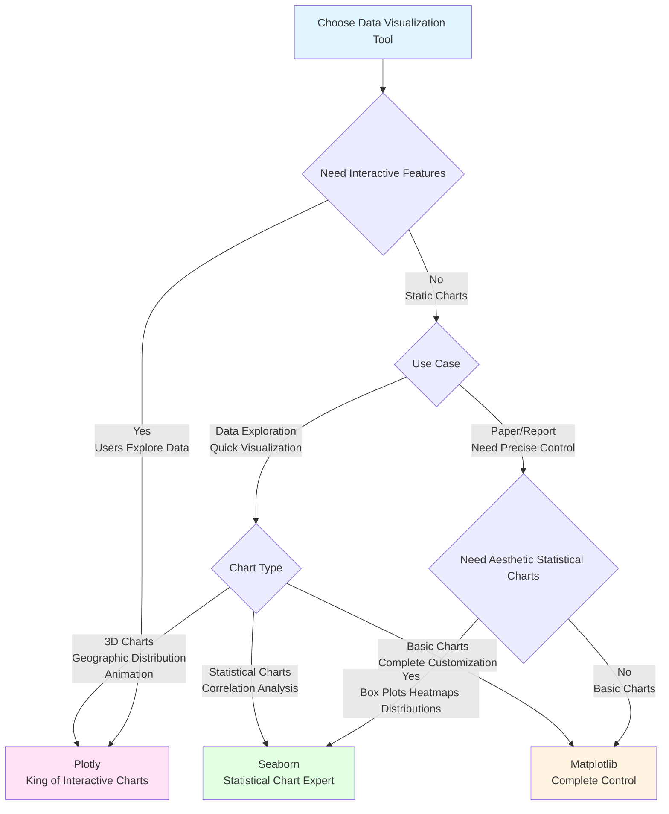

# Data Visualization Trio

## Scenario 1: Precise Control of Static Charts for Scientific Publishing

**Task: Create static charts for papers and reports that require precise control over every detail (fonts, colors, layout)**

> 💡 **Matplotlib = The Swiss Army knife of visualization, limitless underlying control**  
> Like painting with a brush, you can precisely control every stroke, perfect for scenarios that require complete customization!

### Matplotlib - Underlying Control, Unlimited Customization

```python
import matplotlib.pyplot as plt
import pandas as pd
import numpy as np

# Load California housing data
df = pd.read_csv('public/data/california_housing.csv')

# Create multiple subplots with precise control over layout
fig, axes = plt.subplots(2, 2, figsize=(14, 10))
fig.suptitle('California Housing Data Analysis', fontsize=16, fontweight='bold')

# 1. House price distribution histogram - precise control over color, transparency, borders
axes[0, 0].hist(df['median_house_value'], bins=50, alpha=0.7, color='skyblue', edgecolor='black')
axes[0, 0].set_title('House Price Distribution', fontsize=12, fontweight='bold')
axes[0, 0].set_xlabel('Median House Value ($)', fontsize=10)
axes[0, 0].set_ylabel('Frequency', fontsize=10)
axes[0, 0].grid(True, alpha=0.3)

# 2. Income vs house price scatter plot - precise control over point size, color, transparency
axes[0, 1].scatter(df['median_income'], df['median_house_value'], 
                   alpha=0.5, s=20, c=df['housing_median_age'], cmap='viridis')
axes[0, 1].set_title('Income vs House Price Relationship', fontsize=12, fontweight='bold')
axes[0, 1].set_xlabel('Median Income (in 10k $)', fontsize=10)
axes[0, 1].set_ylabel('Median House Value ($)', fontsize=10)

# 3. Box plots for different regions - fully customized
bp = axes[1, 0].boxplot([df[df['ocean_proximity']==cat]['median_house_value'].dropna() 
                          for cat in df['ocean_proximity'].unique()], 
                         labels=df['ocean_proximity'].unique(),
                         patch_artist=True)
# Customize box plot colors
for patch in bp['boxes']:
    patch.set_facecolor('lightblue')
axes[1, 0].set_title('House Price Distribution by Region', fontsize=12, fontweight='bold')
axes[1, 0].set_ylabel('Median House Value ($)', fontsize=10)
axes[1, 0].tick_params(axis='x', rotation=45)

# 4. Time series line plot - complete style control
x = np.linspace(0, 10, 100)
y = np.sin(x)
axes[1, 1].plot(x, y, linewidth=2, color='red', linestyle='-', marker='o', markersize=4, label='sin(x)')
axes[1, 1].plot(x, np.cos(x), linewidth=2, color='blue', linestyle='--', marker='s', markersize=4, label='cos(x)')
axes[1, 1].set_title('Function Graph', fontsize=12, fontweight='bold')
axes[1, 1].set_xlabel('X', fontsize=10)
axes[1, 1].set_ylabel('Y', fontsize=10)
axes[1, 1].legend()
axes[1, 1].grid(True, alpha=0.3)

plt.tight_layout()
plt.savefig('report_chart.png', dpi=300, bbox_inches='tight')  # High-resolution save
plt.show()

print("✅ Advantage: Complete control over every detail, perfect for papers, reports, publications")
```

### Seaborn - Born for Aesthetics, Difficult to Control Details Precisely

```python
import seaborn as sns

# Seaborn focuses on aesthetics but has limited customization capabilities
plt.figure(figsize=(10, 6))
sns.scatterplot(data=df, x='median_income', y='median_house_value', 
                size='housing_median_age', hue='housing_median_age')
plt.title('Income vs House Price Relationship')
# ❌ Difficult to precisely control point size range, color mapping, etc.
# ❌ Difficult to adjust font and spacing for each label
plt.show()
```

### Plotly - Highly Interactive, Not Suitable for Static Export

```python
import plotly.express as px

# Plotly creates interactive charts
fig = px.scatter(df, x='median_income', y='median_house_value', 
                 size='housing_median_age', color='ocean_proximity')
fig.show()

# ❌ Static image export quality is average
# ❌ Difficult to precisely control every pixel
# ✅ Suitable for web display, not for papers and reports
```

**Evaluation:**
- **Matplotlib**: ⭐⭐⭐⭐⭐ Underlying control, perfect for static charts, papers, reports
- **Seaborn**: ⭐⭐⭐ Aesthetic but limited customization
- **Plotly**: ⭐⭐ Interactive, not suitable for static export

---

## Scenario 2: Statistical Analysis and Rapid Exploratory Data Visualization

**Task: Quickly create aesthetic statistical charts to analyze data distribution, correlations, and other statistical characteristics**

> 💡 **Seaborn = One-click generator for statistical charts, beauty is justice**  
> Like using a "beauty filter camera", just one line of code to generate professional statistical charts!

### Seaborn - Statistical Chart Expert, Aesthetic and Efficient

```python
import seaborn as sns
import matplotlib.pyplot as plt
import pandas as pd
import numpy as np

# Load data
df = pd.read_csv('public/data/california_housing.csv')

# Set aesthetic theme
sns.set_style("whitegrid")
sns.set_palette("husl")

# Create multiple statistical charts
fig, axes = plt.subplots(2, 3, figsize=(18, 12))

# 1. Distribution plot - automatically handles kernel density estimation
sns.histplot(data=df, x='median_house_value', kde=True, ax=axes[0, 0])
axes[0, 0].set_title('House Price Distribution (with KDE curve)')

# 2. Box plot - automatic grouping and statistics
sns.boxplot(data=df, x='ocean_proximity', y='median_house_value', ax=axes[0, 1])
axes[0, 1].set_title('House Price Box Plot by Region')
axes[0, 1].tick_params(axis='x', rotation=45)

# 3. Scatter plot with regression line - automatic fitting
sns.regplot(data=df, x='median_income', y='median_house_value', ax=axes[0, 2], scatter_kws={'alpha':0.5})
axes[0, 2].set_title('Income vs House Price Relationship (with regression line)')

# 4. Correlation heatmap - one-click generation
numeric_cols = df.select_dtypes(include=[np.number]).columns
corr_matrix = df[numeric_cols].corr()
sns.heatmap(corr_matrix, annot=True, cmap='coolwarm', center=0, 
            square=True, ax=axes[1, 0], fmt='.2f')
axes[1, 0].set_title('Numeric Variable Correlation Heatmap')

# 5. Violin plot - shows distribution shape
sns.violinplot(data=df, x='ocean_proximity', y='median_house_value', ax=axes[1, 1])
axes[1, 1].set_title('House Price Distribution Shape by Region')
axes[1, 1].tick_params(axis='x', rotation=45)

# 6. Multi-variable paired relationship plot - one-click matrix generation
sample_df = df[['median_income', 'housing_median_age', 'median_house_value']].head(500)
# Note: pairplot doesn't work well with subplots, needs to be drawn separately
sns.scatterplot(data=df, x='housing_median_age', y='median_house_value', 
                size='median_income', hue='ocean_proximity', ax=axes[1, 2], alpha=0.6)
axes[1, 2].set_title('Multi-Variable Relationship Chart')

plt.tight_layout()
plt.show()

# Quickly generate paired relationship plot
sns.pairplot(df[['median_income', 'housing_median_age', 'median_house_value', 'ocean_proximity']].head(500),
             hue='ocean_proximity', diag_kind='kde')
plt.show()

print("✅ Advantage: One line of code to generate professional statistical charts, aesthetic and efficient")
```

### Matplotlib - Requires Extensive Code for Same Results

```python
import matplotlib.pyplot as plt

# Creating heatmap requires extensive manual code
fig, ax = plt.subplots()
im = ax.imshow(corr_matrix, cmap='coolwarm')
# Need to manually add ticks, labels, values, etc...
# Code volume is 5-10 times that of Seaborn
```

### Plotly - Interactive but Statistical Features Less Comprehensive than Seaborn

```python
import plotly.express as px

# Plotly is more focused on interactivity, statistical charts less comprehensive than Seaborn
fig = px.scatter(df, x='median_income', y='median_house_value', 
                 color='ocean_proximity', trendline='ols')
fig.show()
# ❌ No advanced statistical charts like box plots, violin plots, etc.
# ❌ Statistical features less comprehensive than Seaborn
```

**Evaluation:**
- **Seaborn**: ⭐⭐⭐⭐⭐ Statistical chart expert, aesthetic and efficient
- **Matplotlib**: ⭐⭐⭐ Requires extensive code
- **Plotly**: ⭐⭐⭐ Interactive but limited statistical features

---

## Scenario 3: Interactive Data Exploration and Dashboards

**Task: Create interactive visualization charts that support zoom, hover, filtering, and other interactive operations**

> 💡 **Plotly = The Tesla of visualization, unparalleled interactive experience**  
> Like using a touchscreen phone, users can freely explore data and discover insights hidden in the data!

### Plotly - The King of Interactive Charts

```python
import plotly.express as px
import plotly.graph_objects as go
from plotly.subplots import make_subplots
import pandas as pd

# Load data
df = pd.read_csv('public/data/california_housing.csv')

# 1. Geographic scatter plot - supports zoom and hover
fig1 = px.scatter_mapbox(df.sample(1000), 
                        lat='latitude', 
                        lon='longitude',
                        color='median_house_value',
                        size='population',
                        hover_data=['median_income', 'housing_median_age', 'ocean_proximity'],
                        mapbox_style="open-street-map",
                        title='California Housing Geographic Distribution',
                        color_continuous_scale='Viridis')
fig1.update_layout(height=600)
fig1.show()

# 2. 3D scatter plot - supports rotation and zoom
fig2 = px.scatter_3d(df.sample(1000), 
                     x='median_income', 
                     y='housing_median_age', 
                     z='median_house_value',
                     color='ocean_proximity',
                     size='population',
                     hover_data=['total_rooms', 'total_bedrooms'],
                     title='Income-Age-House Price 3D Relationship Chart')
fig2.show()

# 3. Interactive dashboard - multiple chart combination
fig = make_subplots(
    rows=2, cols=2,
    subplot_titles=('House Price Distribution', 'Income vs House Price', 'House Age Distribution', 'Regional Box Plot'),
    specs=[[{"secondary_y": False}, {"secondary_y": False}],
           [{"secondary_y": False}, {"secondary_y": False}]]
)

# House price distribution histogram
fig.add_trace(
    go.Histogram(x=df['median_house_value'], name='House Price Distribution', nbinsx=50),
    row=1, col=1
)

# Income vs house price scatter plot
fig.add_trace(
    go.Scatter(x=df['median_income'], y=df['median_house_value'],
               mode='markers', name='Scatter Plot', 
               marker=dict(size=5, opacity=0.5)),
    row=1, col=2
)

# House age distribution
fig.add_trace(
    go.Histogram(x=df['housing_median_age'], name='House Age', nbinsx=30),
    row=2, col=1
)

# Regional box plot
for cat in df['ocean_proximity'].unique():
    fig.add_trace(
        go.Box(y=df[df['ocean_proximity']==cat]['median_house_value'], 
               name=cat),
        row=2, col=2
    )

fig.update_layout(height=1000, title_text="California Housing Data Dashboard", showlegend=False)
fig.show()

# 4. Animated time series chart (simulated time data)
# Assume we're summarizing data by month
df['month'] = (df.index % 12) + 1
df['year'] = 2020 + (df.index // 12)

fig3 = px.scatter(df, x='median_income', y='median_house_value', 
                  size='population', color='ocean_proximity',
                  animation_frame='month', 
                  hover_name='ocean_proximity',
                  title='Animated Income-House Price Relationship by Month')
fig3.show()

print("✅ Advantage: Powerful interactive features, supports zoom, hover, filtering, animation, etc.")
```

### Matplotlib - Static Charts, No Interactivity

```python
import matplotlib.pyplot as plt

# Matplotlib creates static charts
plt.scatter(df['median_income'], df['median_house_value'])
plt.title('Income vs House Price')
plt.show()

# ❌ Cannot zoom or hover to view specific values
# ❌ Cannot dynamically filter data
# ❌ Cannot create 3D rotatable charts
```

### Seaborn - Based on Matplotlib, Also No Interactivity

```python
import seaborn as sns

# Seaborn is also based on Matplotlib, same limitations
sns.scatterplot(data=df, x='median_income', y='median_house_value')
plt.title('Income vs House Price')
plt.show()

# ❌ Same limitations
```

**Evaluation:**
- **Plotly**: ⭐⭐⭐⭐⭐ King of interactive charts, best user experience
- **Matplotlib**: ⭐⭐ Static charts
- **Seaborn**: ⭐⭐ Static charts

### Decision Tree Selection



### Common Functions for the Three Frameworks

| Feature | Matplotlib | Seaborn | Plotly |
|------|------------|---------|--------|
| **Basic Charts** | `plt.plot()`, `plt.scatter()`, `plt.bar()`, `plt.hist()` | `sns.scatterplot()`, `sns.lineplot()`, `sns.barplot()` | `px.scatter()`, `px.line()`, `px.bar()` |
| **Statistical Charts** | Manual implementation | `sns.boxplot()`, `sns.violinplot()`, `sns.heatmap()` | `px.box()`, `px.violin()` |
| **Distribution Charts** | `plt.hist()`, `plt.density()` | `sns.histplot()`, `sns.kdeplot()` | `px.histogram()`, `px.density_heatmap()` |
| **Regression Analysis** | Manual fitting | `sns.regplot()`, `sns.lmplot()` | `px.scatter(trendline='ols')` |
| **Multi-variable Relationship** | Manual implementation | `sns.pairplot()`, `sns.jointplot()` | `px.scatter_matrix()` |
| **3D Charts** | `ax.plot3D()`, `ax.scatter3D()` | ❌ Not supported | `px.scatter_3d()`, `go.Scatter3d()` |
| **Geographic Distribution** | Requires additional library | ❌ Not supported | `px.scatter_mapbox()`, `px.choropleth()` |
| **Subplot Layout** | `plt.subplots()` | `plt.subplots()` | `make_subplots()` |
| **Animation** | `FuncAnimation` | ❌ Not supported | `px.scatter(animation_frame=)` |
| **Style Theme** | `plt.style.use()` | `sns.set_style()`, `sns.set_palette()` | Built-in templates |
| **Interactive Features** | ❌ No | ❌ No | ✅ Zoom, hover, filter |
| **Export Format** | PNG, PDF, SVG, EPS | PNG, PDF, SVG | HTML, PNG, PDF |

#### 📊 Matplotlib Common Functions Quick Reference

```python
import matplotlib.pyplot as plt
import numpy as np

# Basic charts
x = np.linspace(0, 10, 100)
y = np.sin(x)

plt.figure(figsize=(10, 6))

# Line chart
plt.plot(x, y, label='sin(x)', linewidth=2, color='blue', linestyle='-')
plt.plot(x, np.cos(x), label='cos(x)', linewidth=2, color='red', linestyle='--')

# Scatter plot
plt.scatter(x[:20], y[:20], s=50, c='red', alpha=0.7, marker='o')

# Bar chart
plt.bar(['A', 'B', 'C'], [1, 2, 3], color=['red', 'green', 'blue'])

# Histogram
plt.hist(np.random.randn(1000), bins=30, alpha=0.7, color='skyblue')

# Pie chart
plt.pie([25, 30, 45], labels=['A', 'B', 'C'], autopct='%1.1f%%')

# Settings
plt.title('Title', fontsize=14, fontweight='bold')
plt.xlabel('X-axis Label')
plt.ylabel('Y-axis Label')
plt.legend()
plt.grid(True, alpha=0.3)
plt.xlim(0, 10)
plt.ylim(-1.5, 1.5)

# Subplots
fig, axes = plt.subplots(2, 2, figsize=(12, 10))
axes[0, 0].plot(x, y)
axes[0, 1].scatter(x, y)
axes[1, 0].bar(['A', 'B', 'C'], [1, 2, 3])
axes[1, 1].hist(np.random.randn(1000), bins=30)

# Save
plt.savefig('figure.png', dpi=300, bbox_inches='tight')
plt.show()
```

#### 🎨 Seaborn Common Functions Quick Reference

```python
import seaborn as sns
import matplotlib.pyplot as plt
import pandas as pd

# Set theme
sns.set_style("whitegrid")
sns.set_palette("husl")

df = pd.DataFrame({
    'x': np.random.randn(100),
    'y': np.random.randn(100),
    'category': np.random.choice(['A', 'B', 'C'], 100)
})

# Scatter plot
sns.scatterplot(data=df, x='x', y='y', hue='category', size='x')

# Line chart
sns.lineplot(data=df, x='x', y='y', hue='category')

# Histogram (with KDE)
sns.histplot(data=df, x='y', kde=True, hue='category')

# Box plot
sns.boxplot(data=df, x='category', y='y')

# Violin plot
sns.violinplot(data=df, x='category', y='y')

# Correlation heatmap
corr = df.corr()
sns.heatmap(corr, annot=True, cmap='coolwarm', center=0)

# Regression plot
sns.regplot(data=df, x='x', y='y')

# Paired relationship plot
sns.pairplot(df, hue='category')

# Joint distribution plot
sns.jointplot(data=df, x='x', y='y', kind='hex')

plt.show()
```

#### 🚀 Plotly Common Functions Quick Reference

```python
import plotly.express as px
import plotly.graph_objects as go
import pandas as pd

df = pd.DataFrame({
    'x': np.random.randn(100),
    'y': np.random.randn(100),
    'category': np.random.choice(['A', 'B', 'C'], 100),
    'size': np.random.randint(10, 50, 100)
})

# Scatter plot
fig = px.scatter(df, x='x', y='y', color='category', size='size',
                 hover_data=['category'], title='Scatter Plot')
fig.show()

# 3D scatter plot
fig = px.scatter_3d(df, x='x', y='y', z=np.random.randn(100),
                    color='category', size='size')
fig.show()

# Geographic distribution plot
# fig = px.scatter_mapbox(df, lat='latitude', lon='longitude',
#                         color='category', mapbox_style='open-street-map')
# fig.show()

# Subplots
from plotly.subplots import make_subplots
fig = make_subplots(rows=2, cols=2)
fig.add_trace(go.Scatter(x=df['x'], y=df['y'], mode='markers'), row=1, col=1)
fig.add_trace(go.Bar(x=['A', 'B', 'C'], y=[1, 2, 3]), row=1, col=2)
fig.add_trace(go.Histogram(x=df['x']), row=2, col=1)
fig.update_layout(height=800, title_text="Multi-Subplot Dashboard")
fig.show()

# Animation
# df['frame'] = np.random.choice(range(1, 6), len(df))
# fig = px.scatter(df, x='x', y='y', color='category', 
#                  animation_frame='frame')
# fig.show()
```
