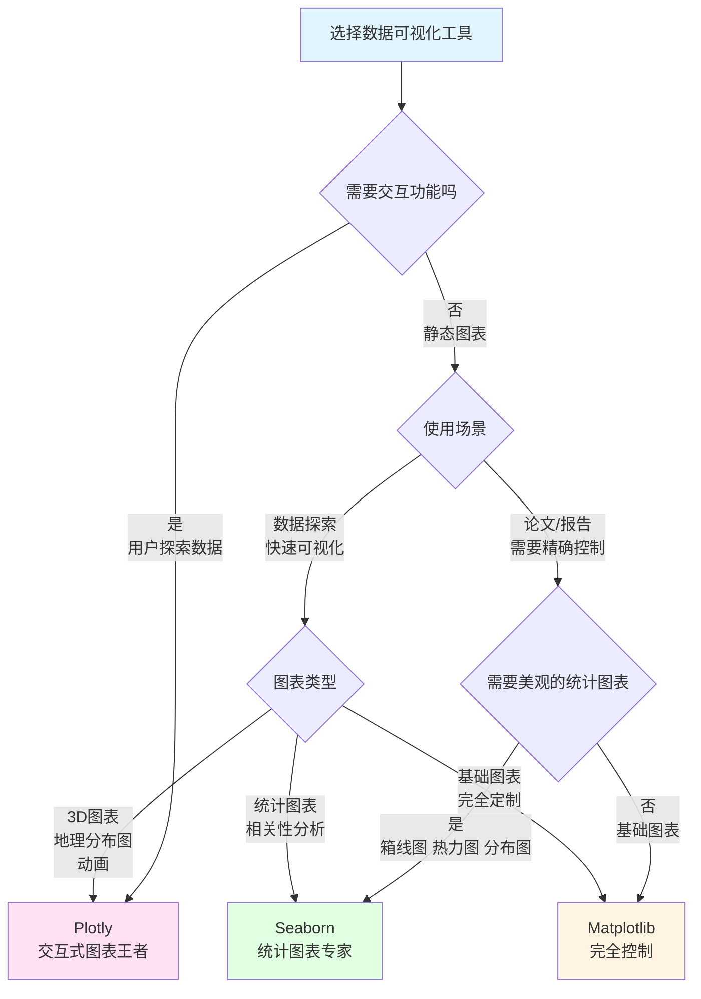

# 数据可视化三剑客

## 场景1：精确控制的静态图表与科学出版

**任务：创建用于论文、报告的静态图表，需要精确控制每个细节（字体、配色、布局）**

> 💡 **Matplotlib = 可视化的瑞士军刀，底层控制无极限**  
> 就像用画笔绘画，你可以精确控制每一笔每一划，适合需要完全定制的场景！

### Matplotlib - 底层控制，定制无极限

```python
import matplotlib.pyplot as plt
import pandas as pd
import numpy as np

# 加载加利福尼亚房产数据
df = pd.read_csv('public/data/california_housing.csv')

# 创建多子图，精确控制布局
fig, axes = plt.subplots(2, 2, figsize=(14, 10))
fig.suptitle('加利福尼亚房产数据分析', fontsize=16, fontweight='bold')

# 1. 房价分布直方图 - 精确控制颜色、透明度、边框
axes[0, 0].hist(df['median_house_value'], bins=50, alpha=0.7, color='skyblue', edgecolor='black')
axes[0, 0].set_title('房价分布', fontsize=12, fontweight='bold')
axes[0, 0].set_xlabel('中位房价 ($)', fontsize=10)
axes[0, 0].set_ylabel('频次', fontsize=10)
axes[0, 0].grid(True, alpha=0.3)

# 2. 收入与房价散点图 - 精确控制点的大小、颜色、透明度
axes[0, 1].scatter(df['median_income'], df['median_house_value'], 
                   alpha=0.5, s=20, c=df['housing_median_age'], cmap='viridis')
axes[0, 1].set_title('收入与房价关系', fontsize=12, fontweight='bold')
axes[0, 1].set_xlabel('中位收入 (单位：万$)', fontsize=10)
axes[0, 1].set_ylabel('中位房价 ($)', fontsize=10)

# 3. 不同地区的房价箱线图 - 完全自定义
bp = axes[1, 0].boxplot([df[df['ocean_proximity']==cat]['median_house_value'].dropna() 
                          for cat in df['ocean_proximity'].unique()], 
                         labels=df['ocean_proximity'].unique(),
                         patch_artist=True)
# 自定义箱线图颜色
for patch in bp['boxes']:
    patch.set_facecolor('lightblue')
axes[1, 0].set_title('不同地区房价分布', fontsize=12, fontweight='bold')
axes[1, 0].set_ylabel('中位房价 ($)', fontsize=10)
axes[1, 0].tick_params(axis='x', rotation=45)

# 4. 时间序列折线图 - 完全控制样式
x = np.linspace(0, 10, 100)
y = np.sin(x)
axes[1, 1].plot(x, y, linewidth=2, color='red', linestyle='-', marker='o', markersize=4, label='sin(x)')
axes[1, 1].plot(x, np.cos(x), linewidth=2, color='blue', linestyle='--', marker='s', markersize=4, label='cos(x)')
axes[1, 1].set_title('函数图像', fontsize=12, fontweight='bold')
axes[1, 1].set_xlabel('X', fontsize=10)
axes[1, 1].set_ylabel('Y', fontsize=10)
axes[1, 1].legend()
axes[1, 1].grid(True, alpha=0.3)

plt.tight_layout()
plt.savefig('report_chart.png', dpi=300, bbox_inches='tight')  # 高分辨率保存
plt.show()

print("✅ 优势：完全控制每个细节，适合论文、报告、出版物")
```

### Seaborn - 为美学而生，难以精确控制细节

```python
import seaborn as sns

# Seaborn 专注于美观，但定制能力有限
plt.figure(figsize=(10, 6))
sns.scatterplot(data=df, x='median_income', y='median_house_value', 
                size='housing_median_age', hue='housing_median_age')
plt.title('收入与房价关系')
# ❌ 难以精确控制点的大小范围、颜色映射等细节
# ❌ 难以调整每个标签的字体、间距等
plt.show()
```

### Plotly - 交互性强，不适合静态导出

```python
import plotly.express as px

# Plotly 创建交互式图表
fig = px.scatter(df, x='median_income', y='median_house_value', 
                 size='housing_median_age', color='ocean_proximity')
fig.show()

# ❌ 导出为静态图片质量一般
# ❌ 难以精确控制每一个像素
# ✅ 适合网页展示，不适合论文报告
```

**优劣评选：**
- **Matplotlib**: ⭐⭐⭐⭐⭐ 底层控制，适合静态图表、论文报告
- **Seaborn**: ⭐⭐⭐ 美观但定制能力有限
- **Plotly**: ⭐⭐ 交互式，不适合静态导出

---

## 场景2：统计分析与快速探索性数据可视化

**任务：快速创建美观的统计图表，分析数据分布、相关性等统计特征**

> 💡 **Seaborn = 统计图表的一键生成器，美观即正义**  
> 就像用"美颜相机"，只需一行代码就能生成专业的统计图表！

### Seaborn - 统计图表专家，美观高效

```python
import seaborn as sns
import matplotlib.pyplot as plt
import pandas as pd
import numpy as np

# 加载数据
df = pd.read_csv('public/data/california_housing.csv')

# 设置美观的主题
sns.set_style("whitegrid")
sns.set_palette("husl")

# 创建多个统计图表
fig, axes = plt.subplots(2, 3, figsize=(18, 12))

# 1. 分布图 - 自动处理核密度估计
sns.histplot(data=df, x='median_house_value', kde=True, ax=axes[0, 0])
axes[0, 0].set_title('房价分布（含KDE曲线）')

# 2. 箱线图 - 自动分组和统计
sns.boxplot(data=df, x='ocean_proximity', y='median_house_value', ax=axes[0, 1])
axes[0, 1].set_title('不同地区房价箱线图')
axes[0, 1].tick_params(axis='x', rotation=45)

# 3. 散点图 + 回归线 - 自动拟合
sns.regplot(data=df, x='median_income', y='median_house_value', ax=axes[0, 2], scatter_kws={'alpha':0.5})
axes[0, 2].set_title('收入与房价关系（含回归线）')

# 4. 相关性热力图 - 一键生成
numeric_cols = df.select_dtypes(include=[np.number]).columns
corr_matrix = df[numeric_cols].corr()
sns.heatmap(corr_matrix, annot=True, cmap='coolwarm', center=0, 
            square=True, ax=axes[1, 0], fmt='.2f')
axes[1, 0].set_title('数值变量相关性热力图')

# 5. 小提琴图 - 显示分布形状
sns.violinplot(data=df, x='ocean_proximity', y='median_house_value', ax=axes[1, 1])
axes[1, 1].set_title('不同地区房价分布形状')
axes[1, 1].tick_params(axis='x', rotation=45)

# 6. 多变量成对关系图 - 一键生成矩阵
sample_df = df[['median_income', 'housing_median_age', 'median_house_value']].head(500)
# 注意：pairplot 不适用于 subplot，需要单独绘制
sns.scatterplot(data=df, x='housing_median_age', y='median_house_value', 
                size='median_income', hue='ocean_proximity', ax=axes[1, 2], alpha=0.6)
axes[1, 2].set_title('多变量关系图')

plt.tight_layout()
plt.show()

# 快速生成成对关系图
sns.pairplot(df[['median_income', 'housing_median_age', 'median_house_value', 'ocean_proximity']].head(500),
             hue='ocean_proximity', diag_kind='kde')
plt.show()

print("✅ 优势：一行代码生成专业统计图表，美观高效")
```

### Matplotlib - 需要大量代码实现同样效果

```python
import matplotlib.pyplot as plt

# 创建热力图需要大量手动代码
fig, ax = plt.subplots()
im = ax.imshow(corr_matrix, cmap='coolwarm')
# 需要手动添加刻度、标签、数值等...
# 代码量是 Seaborn 的 5-10 倍
```

### Plotly - 交互式但统计功能不如 Seaborn

```python
import plotly.express as px

# Plotly 更偏向交互，统计图表不如 Seaborn 丰富
fig = px.scatter(df, x='median_income', y='median_house_value', 
                 color='ocean_proximity', trendline='ols')
fig.show()
# ❌ 没有箱线图、小提琴图等高级统计图表
# ❌ 统计功能不如 Seaborn 全面
```

**优劣评选：**
- **Seaborn**: ⭐⭐⭐⭐⭐ 统计图表专家，美观高效
- **Matplotlib**: ⭐⭐⭐ 需要大量代码
- **Plotly**: ⭐⭐⭐ 交互式但统计功能有限

---

## 场景3：交互式数据探索与仪表板

**任务：创建可交互的可视化图表，支持缩放、悬停、筛选等交互操作**

> 💡 **Plotly = 可视化的"特斯拉"，交互体验无与伦比**  
> 就像用触屏手机，用户可以自由探索数据，发现隐藏在数据背后的洞察！

### Plotly - 交互式图表的王者

```python
import plotly.express as px
import plotly.graph_objects as go
from plotly.subplots import make_subplots
import pandas as pd

# 加载数据
df = pd.read_csv('public/data/california_housing.csv')

# 1. 地理散点图 - 支持缩放、悬停
fig1 = px.scatter_mapbox(df.sample(1000), 
                        lat='latitude', 
                        lon='longitude',
                        color='median_house_value',
                        size='population',
                        hover_data=['median_income', 'housing_median_age', 'ocean_proximity'],
                        mapbox_style="open-street-map",
                        title='加利福尼亚房产地理分布',
                        color_continuous_scale='Viridis')
fig1.update_layout(height=600)
fig1.show()

# 2. 3D散点图 - 支持旋转、缩放
fig2 = px.scatter_3d(df.sample(1000), 
                     x='median_income', 
                     y='housing_median_age', 
                     z='median_house_value',
                     color='ocean_proximity',
                     size='population',
                     hover_data=['total_rooms', 'total_bedrooms'],
                     title='收入-年龄-房价 3D关系图')
fig2.show()

# 3. 交互式仪表板 - 多图表组合
fig = make_subplots(
    rows=2, cols=2,
    subplot_titles=('房价分布', '收入与房价', '房屋年龄分布', '地区箱线图'),
    specs=[[{"secondary_y": False}, {"secondary_y": False}],
           [{"secondary_y": False}, {"secondary_y": False}]]
)

# 房价分布直方图
fig.add_trace(
    go.Histogram(x=df['median_house_value'], name='房价分布', nbinsx=50),
    row=1, col=1
)

# 收入与房价散点图
fig.add_trace(
    go.Scatter(x=df['median_income'], y=df['median_house_value'],
               mode='markers', name='散点图', 
               marker=dict(size=5, opacity=0.5)),
    row=1, col=2
)

# 房屋年龄分布
fig.add_trace(
    go.Histogram(x=df['housing_median_age'], name='房屋年龄', nbinsx=30),
    row=2, col=1
)

# 地区箱线图
for cat in df['ocean_proximity'].unique():
    fig.add_trace(
        go.Box(y=df[df['ocean_proximity']==cat]['median_house_value'], 
               name=cat),
        row=2, col=2
    )

fig.update_layout(height=1000, title_text="加利福尼亚房产数据仪表板", showlegend=False)
fig.show()

# 4. 动画时间序列图（模拟时间数据）
# 假设我们按月统计数据
df['month'] = (df.index % 12) + 1
df['year'] = 2020 + (df.index // 12)

fig3 = px.scatter(df, x='median_income', y='median_house_value', 
                  size='population', color='ocean_proximity',
                  animation_frame='month', 
                  hover_name='ocean_proximity',
                  title='按月变化的收入-房价关系动画')
fig3.show()

print("✅ 优势：强大的交互功能，支持缩放、悬停、筛选、动画等")
```

### Matplotlib - 静态图表，无交互

```python
import matplotlib.pyplot as plt

# Matplotlib 创建的是静态图表
plt.scatter(df['median_income'], df['median_house_value'])
plt.title('收入与房价')
plt.show()

# ❌ 无法缩放、悬停查看具体数值
# ❌ 无法动态筛选数据
# ❌ 无法创建 3D 可旋转图表
```

### Seaborn - 基于 Matplotlib，也无交互

```python
import seaborn as sns

# Seaborn 也基于 Matplotlib，同样无法交互
sns.scatterplot(data=df, x='median_income', y='median_house_value')
plt.title('收入与房价')
plt.show()

# ❌ 同样的限制
```

**优劣评选：**
- **Plotly**: ⭐⭐⭐⭐⭐ 交互式图表王者，用户体验最佳
- **Matplotlib**: ⭐⭐ 静态图表
- **Seaborn**: ⭐⭐ 静态图表

### 决策树选择



### 三大框架常用函数

| 功能 | Matplotlib | Seaborn | Plotly |
|------|------------|---------|--------|
| **基础图表** | `plt.plot()`, `plt.scatter()`, `plt.bar()`, `plt.hist()` | `sns.scatterplot()`, `sns.lineplot()`, `sns.barplot()` | `px.scatter()`, `px.line()`, `px.bar()` |
| **统计图表** | 需手动实现 | `sns.boxplot()`, `sns.violinplot()`, `sns.heatmap()` | `px.box()`, `px.violin()` |
| **分布图** | `plt.hist()`, `plt.density()` | `sns.histplot()`, `sns.kdeplot()` | `px.histogram()`, `px.density_heatmap()` |
| **回归分析** | 需手动拟合 | `sns.regplot()`, `sns.lmplot()` | `px.scatter(trendline='ols')` |
| **多变量关系** | 需手动实现 | `sns.pairplot()`, `sns.jointplot()` | `px.scatter_matrix()` |
| **3D图表** | `ax.plot3D()`, `ax.scatter3D()` | ❌ 不支持 | `px.scatter_3d()`, `go.Scatter3d()` |
| **地理分布** | 需额外库 | ❌ 不支持 | `px.scatter_mapbox()`, `px.choropleth()` |
| **子图布局** | `plt.subplots()` | `plt.subplots()` | `make_subplots()` |
| **动画** | `FuncAnimation` | ❌ 不支持 | `px.scatter(animation_frame=)` |
| **样式主题** | `plt.style.use()` | `sns.set_style()`, `sns.set_palette()` | 内置模板 |
| **交互功能** | ❌ 无 | ❌ 无 | ✅ 缩放、悬停、筛选 |
| **导出格式** | PNG, PDF, SVG, EPS | PNG, PDF, SVG | HTML, PNG, PDF |

#### 📊 Matplotlib 常用函数速查

```python
import matplotlib.pyplot as plt
import numpy as np

# 基础图表
x = np.linspace(0, 10, 100)
y = np.sin(x)

plt.figure(figsize=(10, 6))

# 折线图
plt.plot(x, y, label='sin(x)', linewidth=2, color='blue', linestyle='-')
plt.plot(x, np.cos(x), label='cos(x)', linewidth=2, color='red', linestyle='--')

# 散点图
plt.scatter(x[:20], y[:20], s=50, c='red', alpha=0.7, marker='o')

# 柱状图
plt.bar(['A', 'B', 'C'], [1, 2, 3], color=['red', 'green', 'blue'])

# 直方图
plt.hist(np.random.randn(1000), bins=30, alpha=0.7, color='skyblue')

# 饼图
plt.pie([25, 30, 45], labels=['A', 'B', 'C'], autopct='%1.1f%%')

# 设置
plt.title('标题', fontsize=14, fontweight='bold')
plt.xlabel('X轴标签')
plt.ylabel('Y轴标签')
plt.legend()
plt.grid(True, alpha=0.3)
plt.xlim(0, 10)
plt.ylim(-1.5, 1.5)

# 子图
fig, axes = plt.subplots(2, 2, figsize=(12, 10))
axes[0, 0].plot(x, y)
axes[0, 1].scatter(x, y)
axes[1, 0].bar(['A', 'B', 'C'], [1, 2, 3])
axes[1, 1].hist(np.random.randn(1000), bins=30)

# 保存
plt.savefig('figure.png', dpi=300, bbox_inches='tight')
plt.show()
```

#### 🎨 Seaborn 常用函数速查

```python
import seaborn as sns
import matplotlib.pyplot as plt
import pandas as pd

# 设置主题
sns.set_style("whitegrid")
sns.set_palette("husl")

df = pd.DataFrame({
    'x': np.random.randn(100),
    'y': np.random.randn(100),
    'category': np.random.choice(['A', 'B', 'C'], 100)
})

# 散点图
sns.scatterplot(data=df, x='x', y='y', hue='category', size='x')

# 折线图
sns.lineplot(data=df, x='x', y='y', hue='category')

# 直方图（带KDE）
sns.histplot(data=df, x='y', kde=True, hue='category')

# 箱线图
sns.boxplot(data=df, x='category', y='y')

# 小提琴图
sns.violinplot(data=df, x='category', y='y')

# 相关性热力图
corr = df.corr()
sns.heatmap(corr, annot=True, cmap='coolwarm', center=0)

# 回归图
sns.regplot(data=df, x='x', y='y')

# 成对关系图
sns.pairplot(df, hue='category')

# 联合分布图
sns.jointplot(data=df, x='x', y='y', kind='hex')

plt.show()
```

#### 🚀 Plotly 常用函数速查

```python
import plotly.express as px
import plotly.graph_objects as go
import pandas as pd

df = pd.DataFrame({
    'x': np.random.randn(100),
    'y': np.random.randn(100),
    'category': np.random.choice(['A', 'B', 'C'], 100),
    'size': np.random.randint(10, 50, 100)
})

# 散点图
fig = px.scatter(df, x='x', y='y', color='category', size='size',
                 hover_data=['category'], title='散点图')
fig.show()

# 3D散点图
fig = px.scatter_3d(df, x='x', y='y', z=np.random.randn(100),
                    color='category', size='size')
fig.show()

# 地理分布图
# fig = px.scatter_mapbox(df, lat='latitude', lon='longitude',
#                         color='category', mapbox_style='open-street-map')
# fig.show()

# 子图
from plotly.subplots import make_subplots
fig = make_subplots(rows=2, cols=2)
fig.add_trace(go.Scatter(x=df['x'], y=df['y'], mode='markers'), row=1, col=1)
fig.add_trace(go.Bar(x=['A', 'B', 'C'], y=[1, 2, 3]), row=1, col=2)
fig.add_trace(go.Histogram(x=df['x']), row=2, col=1)
fig.update_layout(height=800, title_text="多子图仪表板")
fig.show()

# 动画
# df['frame'] = np.random.choice(range(1, 6), len(df))
# fig = px.scatter(df, x='x', y='y', color='category', 
#                  animation_frame='frame')
# fig.show()
```
